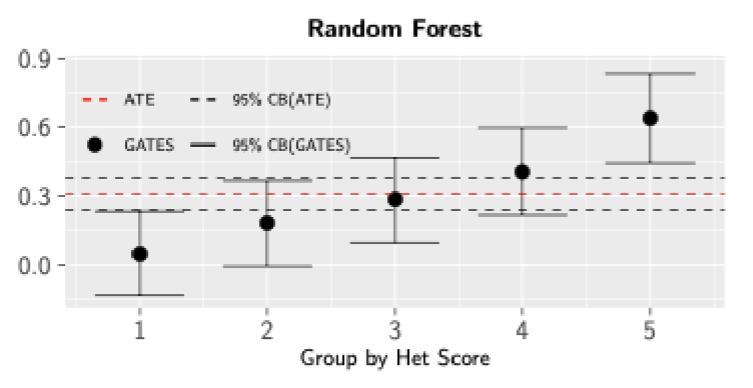

```{r setup, include=FALSE}
knitr::opts_chunk$set(echo = TRUE, warning = FALSE)
```

## Oppgave 1

*Forklar hva vi mener med heterogenitet i behandlingseffekter*

ulikhet i behandlingseffekter.

Påvirker folk på forskjellige måter. Ulikheter innenfor en gruppe som har blitt behandlet. Gjennomsnittet kan være missvisende.

## Oppgave 2

 *Hva er på y-aksen i denne figuren, og hva representerer gruppene?*

På y-aksen burde det stå treatment effect. Ulike grupper som hadde forskjellige behandlingseffekter. Gruppe nummer 5 hadde høy behandlingsefffekt i motsetning til gruppe 1.

## Oppgave 3

*Gi en konseptuel beskrivelse av Generic ML algoritmen til Chernozhukov et. al. (2018). Du kan beskrive algoritmen med en sammenhengende tekst, numerert liste, eller en illustrasjon.*

Estimere Conditional average treatment effect(CATE), bruker ML til å predikere hvordan utfallet ville vært dersom du byttet gruppe. Basert på dine karakterisikker.


Predikere hvordan utfallet ville vært hvis du var i den andre gruppen. 

## Oppgave 4
*Maskinlæring er som kjent et verktøy for prediksjon. Hvilke antagelser ligger til grunn for at algoritmen til Chernozhukov et. al. (2018) kan brukes til kausal inferens*

Forvenet verdi av error gitt T_i, Z_i = 0

## Oppgave 5
*Et av hovedformålene med algoritmen er å produsere en såkalt CLAN*
*1) Hva står CLAN for?*
*2) Hva er CLAN*
*3) Nevn en potensiell fallgruve ved å bruke CLAN resultatene til kausal inferens*

  